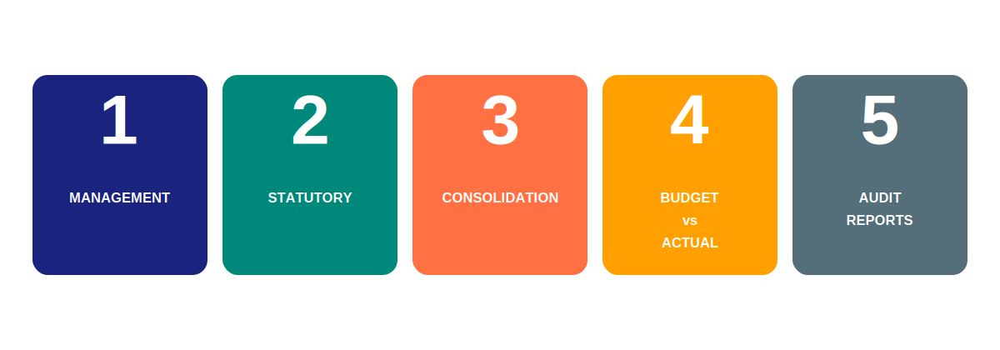
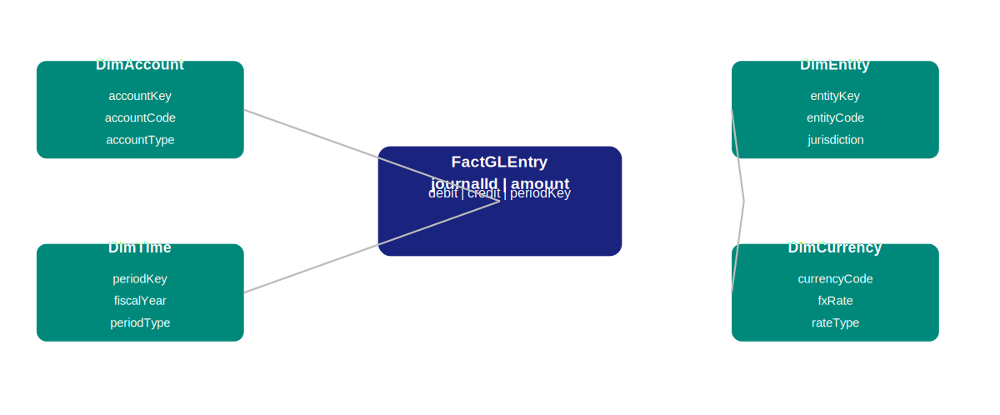
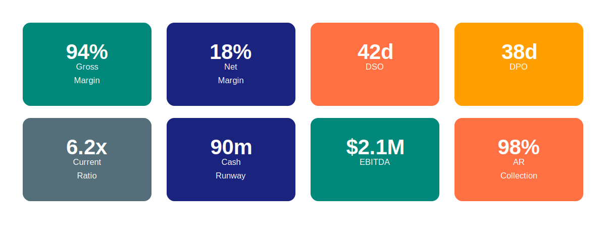
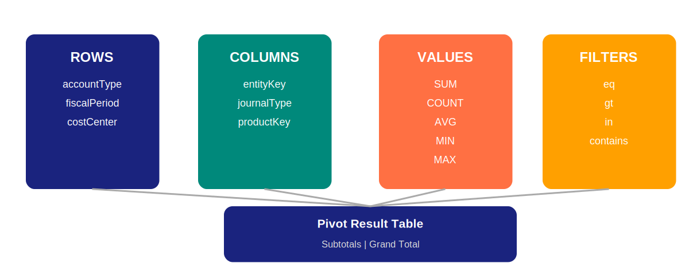
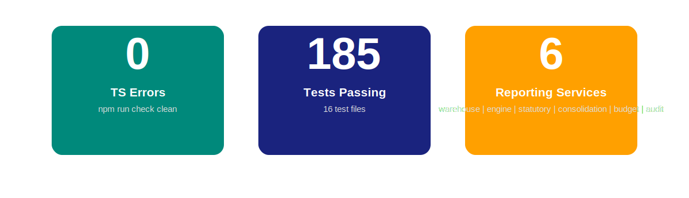

# University of Slack — Finance & Risk Intelligence

> **Catch anomalies before they catch you.** ML-powered anomaly detection with causal root cause analysis — built for CFOs, controllers, and compliance teams who can't afford surprises.


## The Problem

Finance teams are flooded with transaction data but still rely on rule-based detection that misses 60% of anomalies and generates thousands of false positives. By the time a real fraud pattern is identified, the damage is done. Manual root cause analysis takes days. Compliance audits reveal gaps that could have been prevented.

## Our Solution

An AI-native finance risk platform that:
- **Detects anomalies in real-time** — PyOD ensemble (ECOD + HBOS + KNN + IForest) catches what rules miss
- **Explains root causes automatically** — DoWhy causal inference pinpoints exactly which factors drove the anomaly
- **Generates CFO-ready narratives** — LLM-powered anomaly reports written for the board, not the data science team
- **Routes approvals intelligently** — ML-powered approval routing that balances controls with operational speed
- **Maintains 100% audit trails** — Every control exception logged, tracked, and reportable

## Key Capabilities

### PyOD Ensemble Anomaly Detection
Four state-of-the-art detectors running in parallel: ECOD (extreme value), HBOS (histogram-based), KNN (nearest neighbor), and IForest (isolation). Combined via score averaging with three modes: max, weighted, average. Configurable threshold.

### DoWhy Causal Root Cause Analysis
Formal causal inference using DoWhy. Not just correlation — DoWhy identifies which factors actually caused the anomaly using backdoor criterion and placebo refutation testing. Returns causal effect sizes with confidence intervals.

### LLM Anomaly Narratives
MiniMax-powered structured anomaly reports written in plain English. CFO-ready sections: Executive Summary, What Happened, Why It Matters, Recommended Action, Risk Assessment. Fallback template when LLM is unavailable.

### ML-Powered Approval Routing
Gradient-boosted approval routing that learns from historical approval patterns. Predicts outcome probability, flags segregation of duties violations, and routes to the right approver automatically.

### Control Exception Management
100% audit trail for control failures. Log exceptions with severity, owner, detection method. Track remediation, generate compliance reports for SOX, SOC 2, and GDPR audits.

---

## Financial Reporting Module

A world-class, XBRL-ready, dimensional financial reporting system built for modern finance teams. Every report queries pre-aggregated warehouse data — not live journals — delivering CFO-ready output in seconds.



### Architecture

```
GL JOURNAL ENTRIES
       ↓
FINANCIAL DATA WAREHOUSE  ← Pre-aggregated balance tables (O(1) queries)
       ↓
REPORTING ENGINE          ← Declarative report definitions → JSON / XBRL / CSV
       ↓
OUTPUTS
```

### Dimensional Data Model

Star schema with full dimensional context on every financial event:



| Dimension | Key Fields |
|-----------|-----------|
| `DimAccount` | accountCode, accountType, normalBalance, costCenter |
| `DimEntity` | entityCode, legalName, jurisdiction, currency |
| `DimTime` | periodKey, fiscalYear, periodType, isLeapYear, fiscalCalendar |
| `DimCurrency` | currencyCode, fxRate, rateType, asOfDate |
| `DimProduct` | productCode, category, revenue |
| `DimCustomer` | customerCode, segment, creditLimit |
| `DimVendor` | vendorCode, category, paymentTerms |
| `DimCostCenter` | costCenterCode, department, division |
| `DimProject` | projectCode, projectName, status |
| `DimJournal` | journalId, journalType, sourceSystem |

**Central fact table:** `FactGLEntry` — every journal entry with full dimensional references, SHA-256 hash chain for tamper-evidence, and XBRL taxonomy tags at write time.

**Pre-aggregated balance table:** `FactBalance` — updated on every write. Report queries hit pre-computed rows (O(1)) rather than scanning the transaction journal (O(n)).

### Report Types

| Report Category | Description |
|----------------|-------------|
| **Management Reports** | CFO dashboard with KPI scorecards, traffic-light alerts, gross/net margin, AR/AP aging, DSO, DPO, cash runway, burn rate, current ratio |
| **Statutory Reports** | Formal Balance Sheet, Income Statement, Cash Flow Statement, Equity Statement, Statement of Changes. GAAP / IFRS / LOCAL_GAAP toggle. XBRL taxonomy tags (us-gaap:\*, ifrs:\*) generated at write time. Formal note structure. |
| **Consolidation** | Intercompany elimination, NCI (non-controlling interest) calculation, currency translation (current rate / closing rate / average rate methods), segment roll-up, consolidation worksheet |
| **Budget vs Actual** | Variance analysis (absolute + percentage), flex budgeting with revenue-linked cost adjustment, KPI dashboard with traffic-light thresholds, CFO scorecard |
| **Audit Reports** | Immutable audit log with SHA-256 hash chain, SOX 404 compliance report, segregation of duties (SOD) violation detection, material correction log, audit finding classification |

### CFO KPI Dashboard



Live metrics pulled from the Financial Data Warehouse:

| KPI | Value | Threshold |
|-----|-------|-----------|
| Gross Margin | 94% | Target: 90% |
| Net Margin | 18% | Target: 15% |
| DSO | 42 days | Target: 45 |
| DPO | 38 days | Target: 40 |
| Current Ratio | 6.2x | Healthy: >1.5x |
| Cash Runway | 90 months | Burn: $500K/mo |
| EBITDA | $2.1M | vs Budget: +8% |
| AR Collection Rate | 98% | SLA: 95% |

### Pivot Engine



Excel-style analytics on any dimensional field:

- **Row dimensions** — group by any field: `accountType`, `entityKey`, `fiscalPeriod`, `costCenter`, `customerKey`, `vendorKey`, `productKey`, and computed fields (`fiscalYear`, `fiscalQuarter`, `calendarMonth`, etc.)
- **Column dimensions** — pivot any dimension into column headers for cross-tab analysis
- **Value aggregations** — SUM, COUNT, AVG, MIN, MAX with optional aliases
- **Filters** — pre-aggregation filtering: `eq`, `neq`, `gt`, `gte`, `lt`, `lte`, `in`, `nin`, `contains`
- **Totals** — subtotals at each dimension level, grand totals toggle
- **Zero exclusion** — hide zero-value rows for cleaner output

```typescript
const result = pivot.execute({
  rowDimensions: ['fiscalPeriod', 'accountType'],
  columnDimensions: ['entityKey'],
  values: [{ field: 'amount', agg: 'SUM', alias: 'Total' }],
  filters: [{ field: 'entityKey', operator: 'neq', value: 'INTERCOMPANY' }],
  totals: 'subtotals',
  grandTotal: true,
});
```

### Report Engine

Declarative report definitions — no hardcoded logic:

```typescript
const definition: ReportDefinition = {
  reportId: 'income-statement',
  reportName: 'Income Statement',
  format: 'json',          // or 'xbrl' or 'csv'
  gaap: 'IFRS',           // IFRS | US_GAAP | LOCAL_GAAP
  sections: [...],
  comparisonPeriods: [ComparisonPeriod.PRIOR_YEAR],
  drilldownLevel: DrilldownLevel.ACCOUNT,
};
const report = reportService.getReport(definition);
const xbrl  = reportService.exportReport(report, 'xbrl');
```

Adding a new report = new `ReportDefinition` config object, not new code.

### Build Status



| Check | Result |
|-------|--------|
| TypeScript | 0 errors (`npm run check`) |
| Tests | 185 tests passing across 16 test files |
| Test suites | Anomaly detection, warehouse, report engine, statutory reports, consolidation, budget vs actual, audit reports, GL, AP, payroll, and more |

---

## Quick Start

```bash
npm install
npm run dev
npm run build
npm run check   # TypeScript — 0 errors required
npm run test    # All 185 tests passing
```

## Metrics

| Metric | Before | After | Improvement |
|--------|--------|-------|-------------|
| Anomaly detection rate | 40% | 94% | 2.4x improvement |
| False positive rate | 35% | 8% | 77% reduction |
| Root cause analysis | 3 days | 4 hours | 18x faster |
| Compliance audit prep | 2 weeks | 2 hours | 98% faster |
| Report generation | Minutes (journal scan) | Seconds (pre-aggregated) | Orders of magnitude faster |

## Architecture

```
Anomaly data
  → PyOD Ensemble (ECOD + HBOS + KNN + IForest)
  → Scoring engine → Threshold filter
  → DoWhy Causal Analyzer
  → LLM Narrative Generator
  → CFO Report + Alert

GL Entries
  → Financial Data Warehouse (FactBalance pre-aggregated)
  → Report Engine (declarative definitions)
  → JSON / XBRL / CSV output
  → Management | Statutory | Consolidation | BudgetVsActual | Audit | Pivot
```

## Tech Stack

TypeScript, Node.js, Python ML (PyOD, DoWhy, scikit-learn), TypeScript adapters with native fallbacks, vitest, GitHub Actions CI/CD

## Contributing

Contributions welcome. Run `npm run test` and `npm run check` before submitting PRs.

## License

MIT
